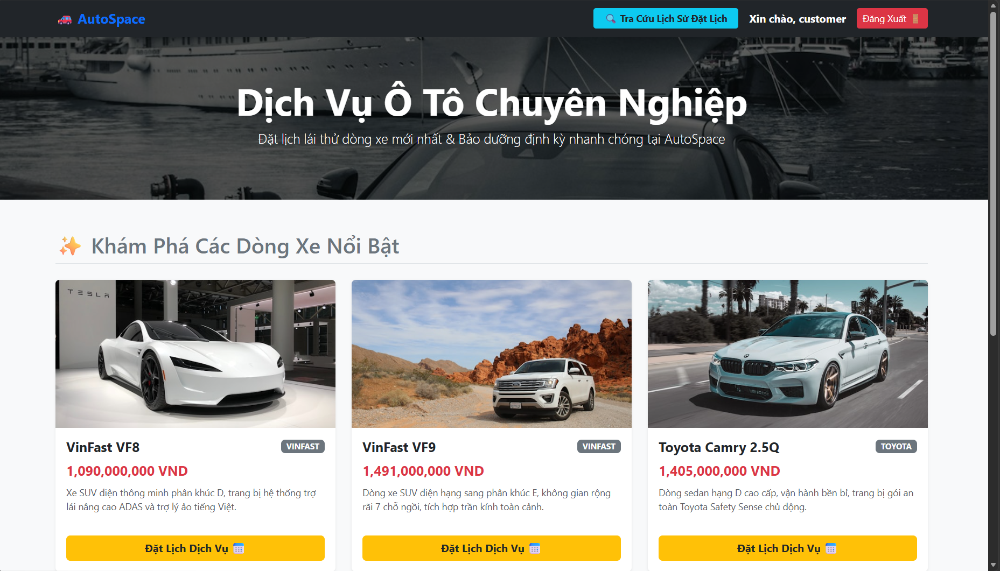
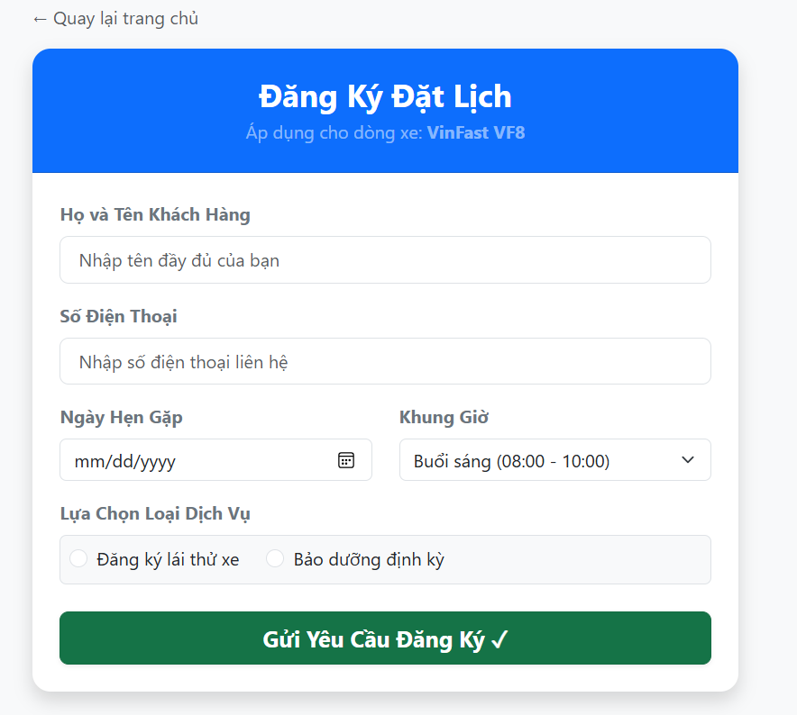
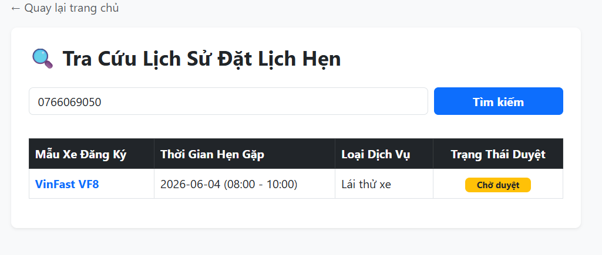
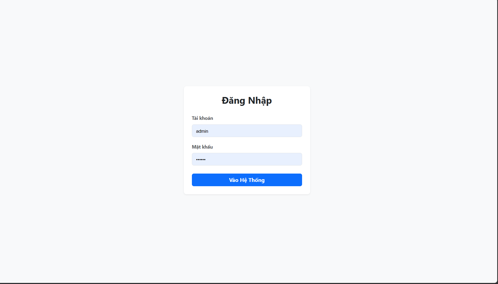
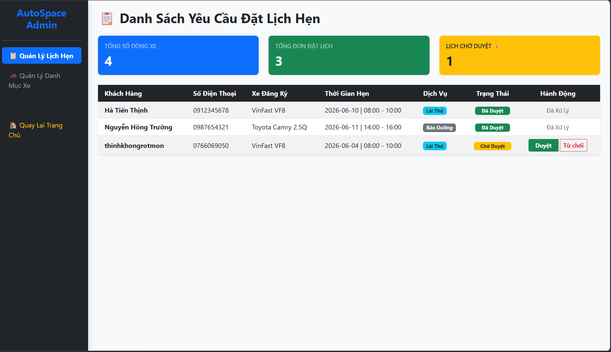

# 🚗 AutoSpace - Hệ Thống Quản Lý Đặt Lịch Bảo Dưỡng Ô Tô

Đồ án kết thúc học phần môn **Phát triển ứng dụng Web 2** - Đại học Nha Trang (NTU). 
**AutoSpace** là hệ thống web nội bộ giúp số hóa quy trình quản lý danh mục xe ô tô và xử lý các yêu cầu đặt lịch hẹn (lái thử, bảo dưỡng định kỳ) trực tuyến một cách nhanh chóng, minh bạch.

---

## 💻 Nền tảng Công nghệ
* **Backend:** Java 17, Spring Boot (v3.2.x), Spring Data JPA.
* **Frontend:** HTML5, CSS3, Bootstrap 5, Thymeleaf Template Engine.
* **Database:** MySQL (XAMPP).
* **Công cụ phát triển:** Eclipse / Spring Tool Suite, Apache Maven, Git.

---

## ✨ Các chức năng chính & Hình ảnh thực tế

### 1. Phân hệ Khách hàng (Customer)

**🔍 Xem danh sách xe & Thông tin chi tiết**
Hệ thống hiển thị trực quan các dòng xe ô tô hiện có tại showroom. Dữ liệu (Tên, hãng, giá, hình ảnh) được tải động từ cơ sở dữ liệu MySQL.

**📝 Đăng ký đặt lịch trực tuyến**
Khách hàng điền form đăng ký trực tuyến, lựa chọn dòng xe mong muốn, ngày giờ và loại dịch vụ (Lái thử xe hoặc Bảo dưỡng định kỳ).

**🔎 Tra cứu lịch sử bằng Số điện thoại**
Khách hàng nhập số điện thoại để tra cứu tiến độ duyệt đơn thời gian thực. Các nhãn trạng thái hiển thị rõ ràng: Chờ duyệt (Vàng) / Đã duyệt (Xanh) / Từ chối (Đỏ).

---

### 2. Phân hệ Quản trị viên (Admin)

**🔐 Xác thực & Phân quyền**
Hệ thống cấp quyền truy cập vào trang quản trị thông qua bộ lọc Session của Java.

**📊 Dashboard & Phê duyệt lịch hẹn**
Giao diện quản trị tính toán thống kê số lượng đơn. Admin kiểm tra tính hợp lệ của khung giờ và tiến hành thao tác bấm **Phê duyệt** hoặc **Từ chối** đơn. Hệ thống tự động đồng bộ trạng thái.

---

